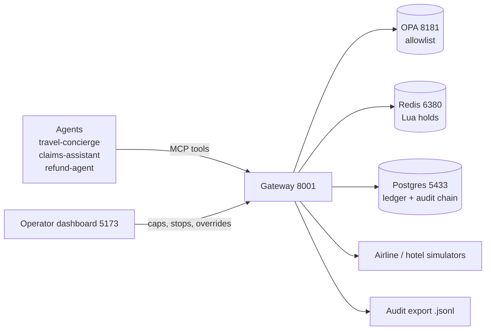
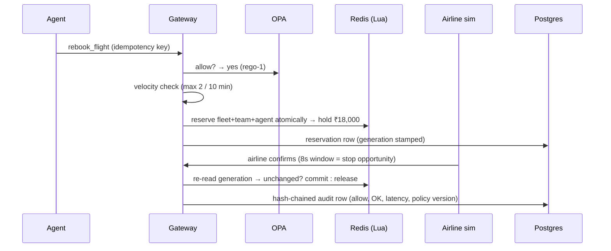

# Governance Layer for Financial Agents

The safety infrastructure that lets a bank deploy fleets of autonomous agents
responsibly. **Every airline, hotel, and notification call passes through this
gate first** — permission check, budget hold, emergency stop, and a
hash-chained audit row. Without it, agent autonomy is a systemic risk. With
it, autonomy is shippable.

## 1. Purpose — what problem does this solve?

As autonomous AI agents multiply across financial services, even well-designed
agents create systemic risk at scale: one mispriced rebooking loop can burn
through a budget in minutes, with no record of who allowed what, and no way
to stop it mid-flight. Manual oversight does not scale to machine-speed
spending.

This project is the **control plane** that answers four questions for every
money-touching call:

1. **Is this agent allowed this action?** — granular per-agent allowlist in
   Open Policy Agent (`rebook_flight` allow, `wire_funds` deny), versioned
   bundles, live decision matrix on the dashboard.
2. **Does the money fit?** — a fleet → team → agent budget tree, reserved
   atomically in one Redis Lua script. The denial names the exact node:
   `FLEET_CAP`, not `AGENT_CAP`.
3. **Can we stop it right now?** — per-agent revoke, per-team stop, and a
   fleet-wide emergency stop on a generation clock. In-flight holds release;
   committed bookings stay 0.
4. **Can we prove it later?** — every decision is a hash-chained audit row.
   Tamper with one byte and verification names the broken sequence. Export
   to `.jsonl` for SIEM ingestion.

And when the gate says no, there is a process — not a dead end: a human
proposes an override with a reason, a *different* human approves, the cap is
raised visibly, and the call is retried through the normal gate. The allowlist
itself can never be overridden.

## 2. System overview



One `rebook_flight` (₹18,000) passes through the gate like this:



## 3. Demo — Actor dropdown + buttons, in order

```bash
cd deploy
docker compose up --build
```

Dashboard: **http://localhost:5173** · API: http://localhost:8001

| # | Action | What you see |
|---|---|---|
| 1 | Actor `refund-agent` + `1. Allow` | Rebook denied `ACTION_NOT_ALLOWED` — a notify-only agent, least privilege live. |
| 2 | `Preview a ₹10,000 cap` | "Would stop at travel-concierge. Nothing saved." Dry run. |
| 3 | `2. Cap at ₹10,000` | ₹18,000 denied before any money moves. Committed stays 0. |
| 4 | `1. Allow a ₹18,000 reissue` | Hold lands on fleet + team + agent, then commits. Ledger row flips `reserved → committed`. |
| 5 | `3. Start a live booking`, then **Emergency stop** mid-hold | Generation moves, hold releases to ₹0, committed stays 0. An incident sheet builds itself from the chain. |
| 6 | `5. Two agents, one fleet cap` | First agent commits ₹18k of a ₹20k fleet; the second is stopped with `FLEET_CAP` — not `AGENT_CAP`. The tree difference, on screen. |
| 7 | `Corrupt one audit row` | Chain status turns red and names the broken sequence. |
| 8 | `6. Try wire_funds` | Denied by the allowlist before any hold. The matrix row, live. |
| 9 | Overrides section | Reason + name → pending → approve as a *different* name → cap visibly raised → retry allowed. Same name → 400 (maker-checker). |

Further reading: [`docs/ARCHITECTURE.md`](docs/ARCHITECTURE.md) (gate order,
failure modes, scaling, load numbers).

## 4. How the gate decides (in order, fail-closed)

1. Agent registered? Revoked, team-stopped, or fleet-stopped?
2. OPA allowlist (`policies/authz.rego`, version `rego-1`). Down → `POLICY_UNAVAILABLE`.
3. Velocity: 3rd spend action in 10 minutes → `VELOCITY`. Counted off the
   audit trail, so a tampered row degrades to "skip row", never "gate down".
4. One Lua script reserves fleet + team + agent together — no partial holds.
5. Reservation stamped with both generations; the airline simulator runs.
6. Re-read generations: stopped or stale → release (`STALE_GENERATION`).
   Redis down anywhere → `CONTROL_PLANE_UNAVAILABLE`, airline never called.
7. Commit + audit. Every denial is audited too.

Overrides fix `*_CAP` denies only: propose (node + reason + requester) →
approve by someone else → node cap becomes spent + amount → original call
retries through the full gate. Humans can accept spend risk, never permission
risk.

## 5. Project structure

```
fleet-governance/
├── gateway/            # pipeline, server (MCP + REST), db, redis_store, opa_client, simulators
│   ├── pipeline.py     # allow → velocity → Lua hold → adapter → generation check → commit
│   ├── reserve.lua     # atomic fleet/team/agent hold, names the failing node
│   └── schema.sql      # budget nodes, agents, control, reservations, audit chain, overrides
├── policies/           # authz.rego (live) + authz.v2.rego.example (tighter, no code change)
├── web/                # fleet dashboard: generation clock, tree, blast radius, ledger, audit
├── tests/              # 17 integration tests — run in Docker (below)
├── deploy/             # docker-compose.yml + Dockerfile + .env.example
├── docs/               # ARCHITECTURE.md — full system design
├── bench.py            # read-path load harness (stdlib only)
└── requirements.txt    # uvicorn, redis, psycopg, httpx, pytest, mcp
```

## 6. Configuration, tests, load

No `.env` file is needed: compose ships safe demo fallbacks and every service
reads its URL from the environment. Copy `deploy/.env.example` to
`deploy/.env` only to override. No secrets are committed — `.env` is
gitignored. Pristine numbers: `docker compose down -v` before `up`.

```bash
# 17 integration tests (needs the stack up; runs inside Docker):
docker compose -f deploy/docker-compose.yml run --rm --no-deps \
  -v "$PWD/tests:/tests" governance \
  python -m pytest /tests -q -o pythonpath="/app" -p no:cacheprovider
# caps, fleet-cap, e-stop, idempotency, velocity isolation, audit tamper,
# rebuild, overrides, OPA-down — all green.

python bench.py 50 50   # read-path: budget p95 ~950ms at 50-burst, zero 500s
```

Notes from measuring (not guessing): async Redis client, gathered reads,
bounded fan-out (pool 400, max 20 concurrent views). Single worker is
deliberate — simulator counters live in-process; scale-out must externalize
them first.

## 7. Tech stack

Python (MCP + Starlette) · Open Policy Agent · Redis 7 (Lua) ·
PostgreSQL 16 · React + Vite · Docker Compose.
